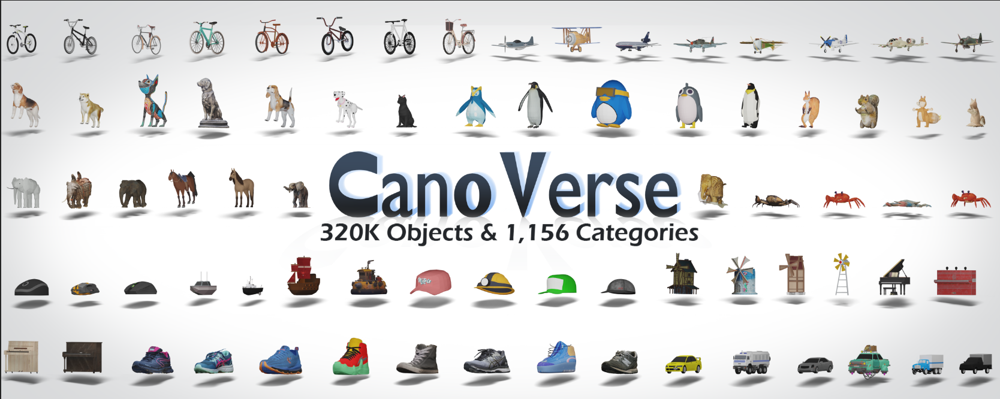
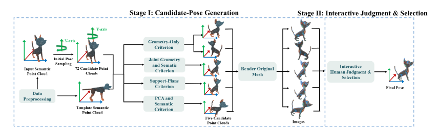
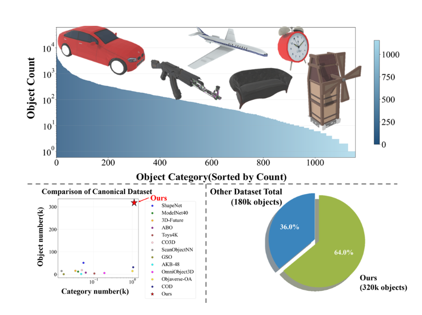
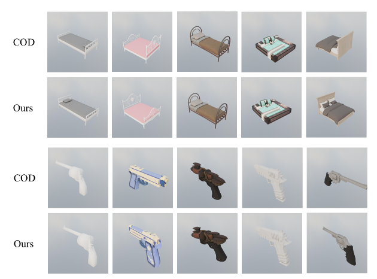
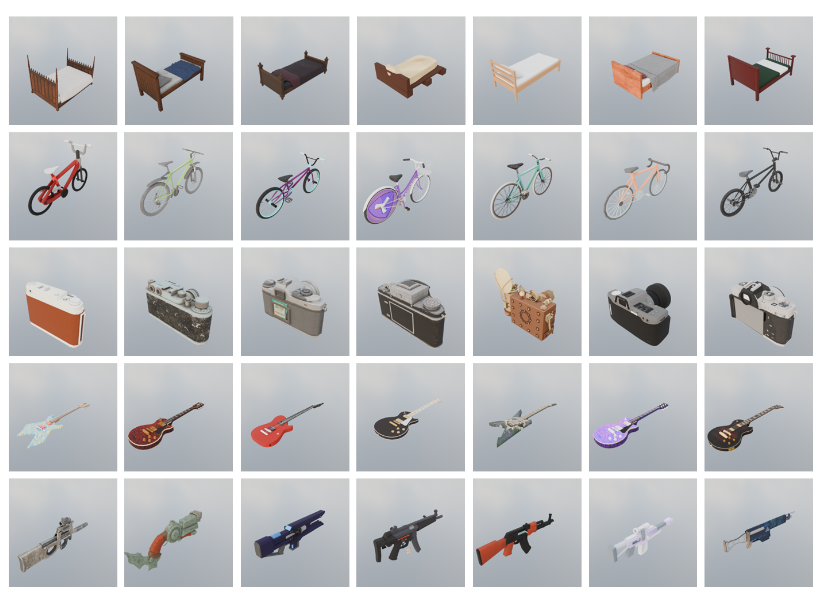
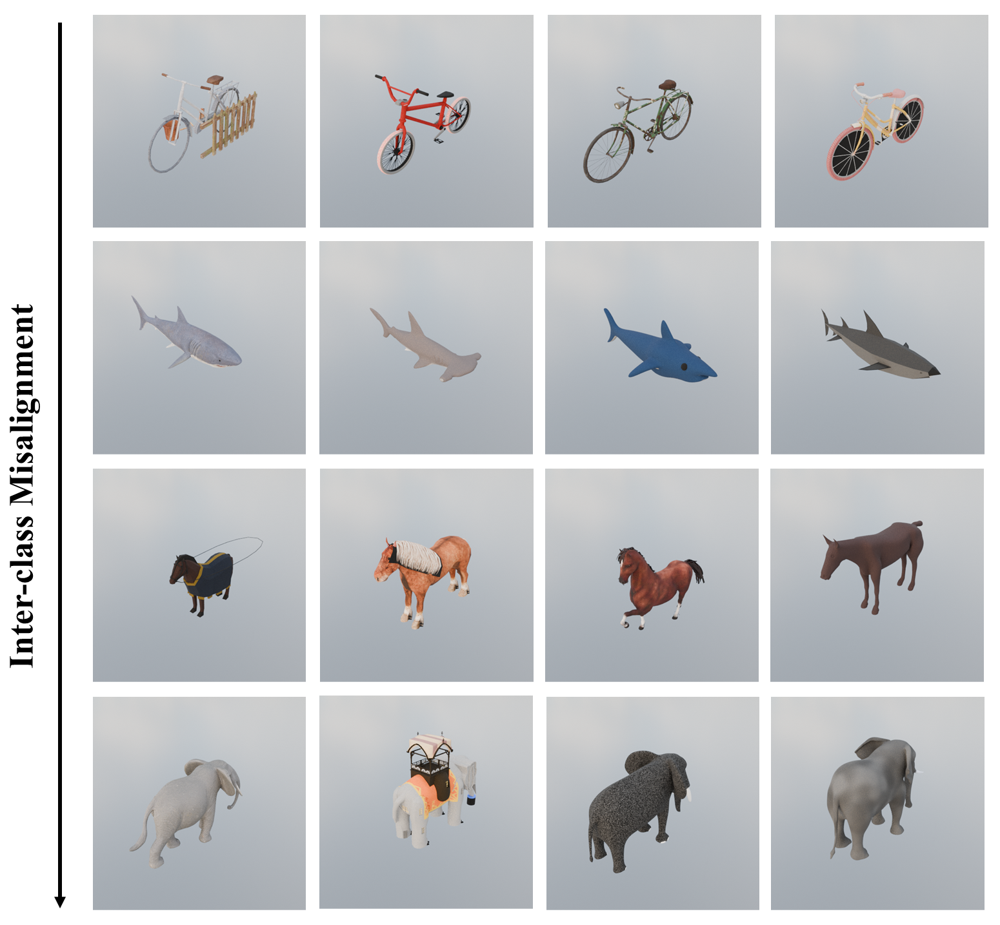
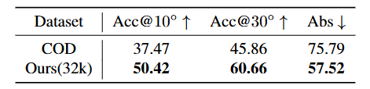

# CanoVerse
This is the repository of CanoVerse, which contains 320k canonical data of Objaverse, Objaverse-XL and the code of orientation estimation.
{width=100%}
# Overview
{width=100%}
# Dataset
We developed a larger dataset containing 320k samples—a size that exceeds the total volume of all existing canonicalization datasets.
{width=100%}
## Compare to [COD](https://github.com/JinLi998/CanonObjaverseDataset)
We have better canonicalization quality compare to COD.
{width=100%}

We also perform inter-class alignment whereas cod not.
Ours:
{width=100%}

COD:
{width=100%}

Quantitative comparison between the COD dataset and our dataset(32k).

   

## Dataset Usage

1. Please refer to the `canoverse_anno/canoverse_poses_32k.json` file to get the UIDs of CanoVerse.
2. Download meshes from [Objaverse](https://objaverse.allenai.org/docs/intro) using the UIDs according to their documentation.
3. Convert the file format to `.obj` files using `trimesh` or `Blender`.
4. Normalize the translation and scale. You can refer to `utils/cano_utils.py` for implementation details.
5. Apply the rotation matrix from `canoverse_anno/canoverse_poses_32k.json` to the mesh. This file also contains category information.

## Orientation Estimation

Please refer to `downstream_task/orientation_estimation/README.md`.

## Note

We only release a subset of CanoVerse. We will release all data in the future.
