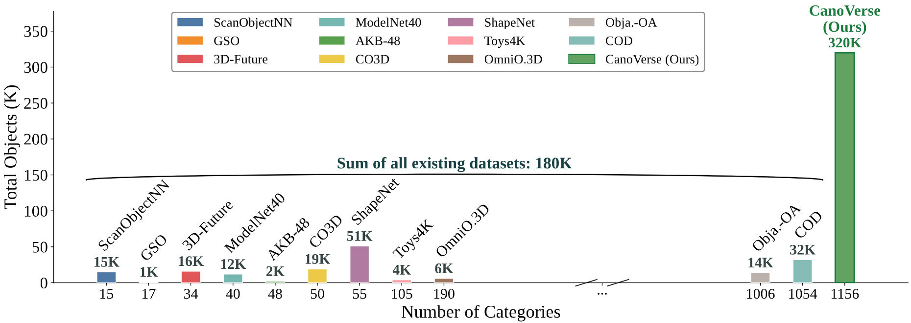

# News

1. Our work has been accepted by **ECCV 2026**! 🎉 Read the paper: [CanoVerse: 3D Object Scalable Canonicalization and Dataset for Generation and Pose](https://arxiv.org/html/2603.07144v1)

2. The complete **320K canonical dataset** is now fully open-sourced! 🚀

The dataset supports **two usage modes**:

### Option 1: Download Pre-processed GLB Meshes (Recommended)

We have uniformly preprocessed all mesh files into GLB format. Download directly from:
[Dataset on ModelScope](https://www.modelscope.cn/datasets/kongbai11A/my_dataset/files)

> Use the Linux `cat` command to concatenate split files with identical prefixes in numerical order, then extract them one by one.  
> **Extraction password:** `X)SRY<kG`

### Option 2: Use Rotation Annotations & Process Yourself

Download the original meshes from [Objaverse](https://objaverse.allenai.org/docs/intro) and apply the rotation matrices in `canoverse_anno/canoverse_poses_part00*.json`. See [Dataset Usage](#-dataset-usage) below for detailed steps.

---

# 🌟 CanoVerse

Welcome to CanoVerse! 🎉 This repository contains 320K canonical data from Objaverse and Objaverse-XL.

✨ **Key Features:**
- 📊 **Large-scale Dataset**: 320K curated canonical 3D objects (combining manual screening and automated processing).
- 🔧 **Ready-to-use**: Complete code and documentation provided.

<div style="text-align: center;">
  
</div>

# 📋 Overview

Our method provides an effective approach for 3D object canonicalization, as illustrated in the diagram below:

<div style="text-align: center;">
  
</div>

# 📚 Dataset Usage

## Option 1: Download Pre-processed GLB Meshes

We have uniformly preprocessed all mesh files into GLB format. (If you require the original raw mesh data, please download it directly from the official Objaverse website and process it with the JSON files.)

[Dataset on ModelScope](https://www.modelscope.cn/datasets/kongbai11A/my_dataset/files)

Use the Linux `cat` command to concatenate split files with identical prefixes in numerical order, then extract them one by one.

**Extraction password:** `X)SRY<kG`

## Option 2: Apply Rotation Annotations Yourself

Our rotation and classification information is stored in the `canoverse_anno/canoverse_poses_part00*.json` file. The internal information is as follows:

```json
{
"cead797bdcf84abfb1cf91f5113b676a": {   // Object UID in Objaverse and Objaverse-XL
    "rotation_matrix": [                // Rotation Matrix
      [
        0.6427876353263855,
        0.0,
        -0.7660444378852844
      ],
      [
        0.0,
        1.0,
        0.0
      ],
      [
        0.7660444378852844,
        0.0,
        0.6427876353263855
      ]
    ],
    "category": "backpack"              // Category
  }
  ........
}
```

Follow these steps to use the CanoVerse dataset in your research:

1. 📋 **Get UIDs**: Refer to the `canoverse_anno/canoverse_poses_part00*.json` file to obtain the unique identifiers (UIDs) of CanoVerse objects.
2. 📥 **Download Meshes**: Download 3D meshes from [Objaverse](https://objaverse.allenai.org/docs/intro) using the UIDs according to their official documentation.
3. 🔄 **Convert Format**: Convert the file format to `.obj` or `.glb` files using `trimesh` and `Blender`.
4. ⚖️ **Normalize**: Normalize the translation and scale.
5. 🔧 **Apply Rotation**: Apply the rotation matrix from `canoverse_anno/canoverse_poses_part00*.json` to the mesh. This file also contains category information.
6. 🔧 You can refer to `utils/cano_mesh.py` for implementation details of step 4 and 5.
