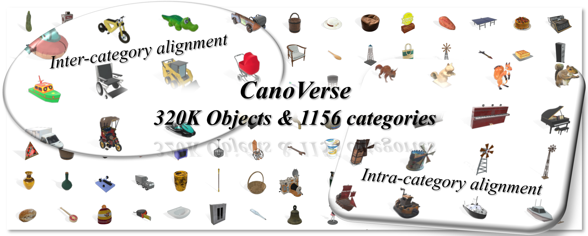
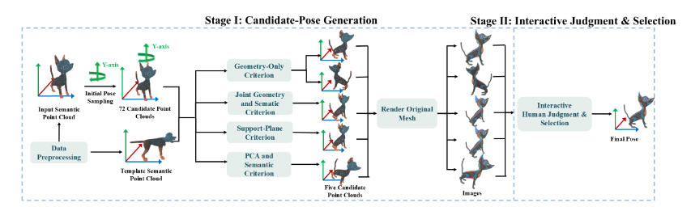
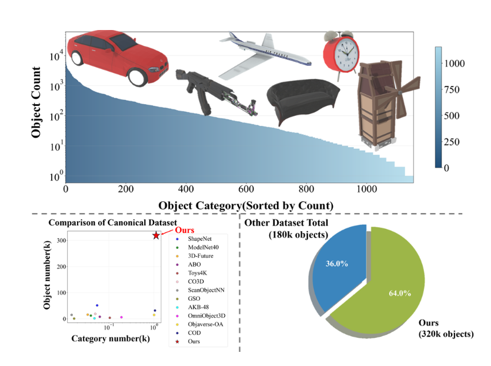
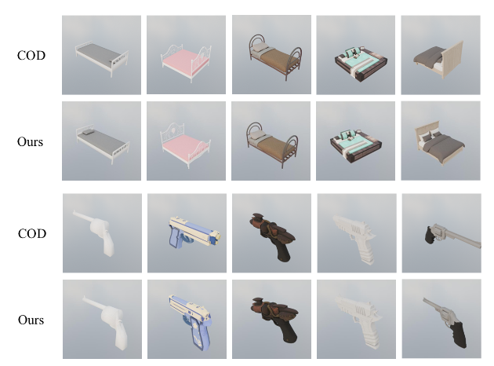
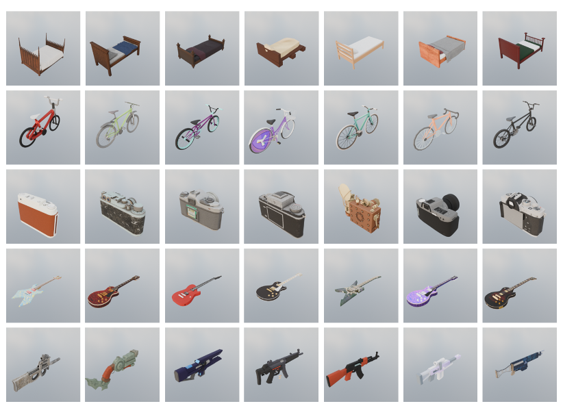
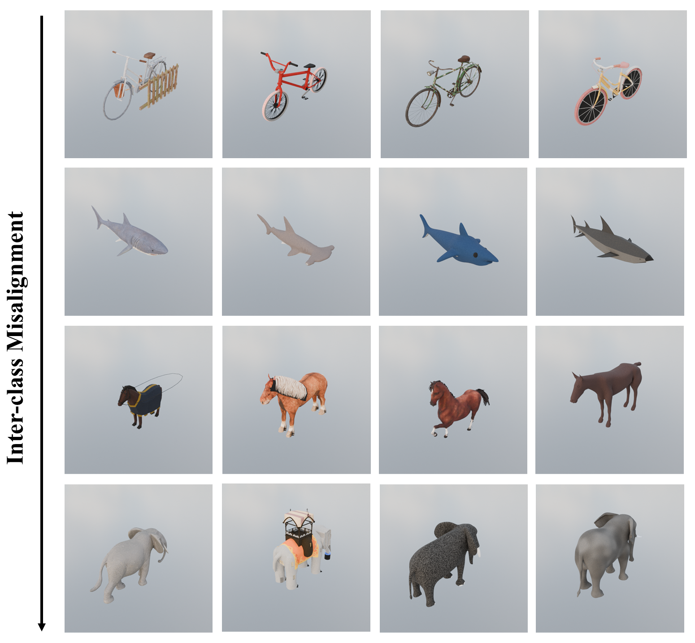

# 🌟 CanoVerse
Welcome to CanoVerse! 🎉 This repository contains 320k canonical data from Objaverse and Objaverse-XL, along with code for orientation estimation.

✨ **Key Features:**
- 📊 **Large-scale Dataset**: 320k curated canonical 3D objects (combining manual screening and automated processing)
- 🔧 **Ready-to-use**: Complete code and documentation provided
<div style="text-align: center;">
  
</div>

# 📋 Overview
Our method provides an effective approach for 3D object canonicalization, as illustrated in the diagram below:
<div style="text-align: center;">
   
</div>

# 📦 Dataset
We curated a large-scale dataset containing 320k canonical objects—a size that exceeds the total volume of all existing canonicalization datasets. 🚀
<div style="text-align: center;">
   
</div>

## 🏆 Comparison with [COD](https://github.com/JinLi998/CanonObjaverseDataset)
We achieve better canonicalization quality compared to COD, as demonstrated below:
<div style="text-align: center;">
  
</div>

Additionally, we perform inter-class alignment, whereas COD does not. 🔄

**Our Data:**
<div style="text-align: center;">
   
</div>

**COD Data:**
<div style="text-align: center;">
   
</div>

## 📚 Dataset Usage
Our rotation and classification information is stored in the `canoverse_anno/canoverse_poses_32k.json` file. The internal information is as follows:
```json
{
"cead797bdcf84abfb1cf91f5113b676a": {   // Object UID in Objaverse and Objaverse-XL
    "rotation_matrix": [                // Rotation Matrix
      [
        0.6427876353263855,
        0.0,
        -0.7660444378852844
      ],
      [
        0.0,
        1.0,
        0.0
      ],
      [
        0.7660444378852844,
        0.0,
        0.6427876353263855
      ]
    ],
    "category": "backpack"              // Category
  }
  ........
}

```

Follow these steps to use the CanoVerse dataset in your research:

1. 📋 **Get UIDs**: Refer to the `canoverse_anno/canoverse_poses_32k.json` file to obtain the unique identifiers (UIDs) of CanoVerse objects.
2. 📥 **Download Meshes**: Download 3D meshes from [Objaverse](https://objaverse.allenai.org/docs/intro) using the UIDs according to their official documentation.
3. 🔄 **Convert Format**: Convert the file format to `.obj` files using `trimesh` and `Blender`.
4. ⚖️ **Normalize**: Normalize the translation and scale. 
5. 🔧 **Apply Rotation**: Apply the rotation matrix from `canoverse_anno/canoverse_poses_32k.json` to the mesh. This file also contains category information.
6. 🔧 You can refer to `utils/cano_mesh.py` for implementation details of step 4 and 5.

## ⚠️ Important Note

🔄 **Current Release**: We currently release only a subset of CanoVerse.  
🚀 **Future Release**: The complete dataset will be released in the future.
